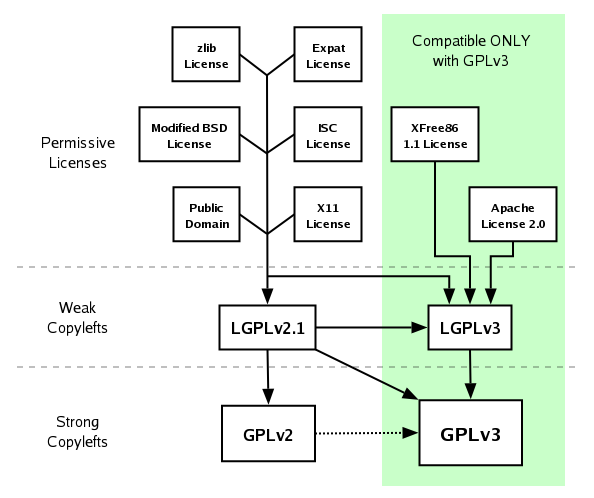

# [Mail.tm](https://mail.tm "Visit mail.tm") and [Mail.gw](https://mail.gw "Visit mail.tm") Client (Un-Official)

[Mail.tm](https://mail.tm "Visit") is a temporory email providing service. They have a vey descent website and you can access it through your desktop and smartphone. I am attempting to create an unofficial client app for their service. It took me 5 days to code this much. The app is not fully ready.

## Current Staus

The app is not ready for end-user.  But this will be happening soon.

## License : GPLv-3.0

## Contributing

My Intention is to release this app in F-droid. 

Please don't use any libray that is not compatiable with GPL 3.

Source [https://www.gnu.org/licenses/quick-guide-gplv3.en.html](https://www.gnu.org/licenses/quick-guide-gplv3.en.html)

**this website could be helpful [https://api.mail.tm](https://api.mail.tm)**

## Translations

The source code is not yet ready for translations.
